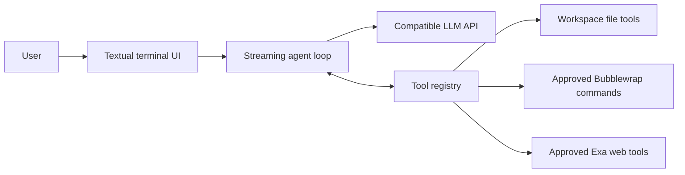
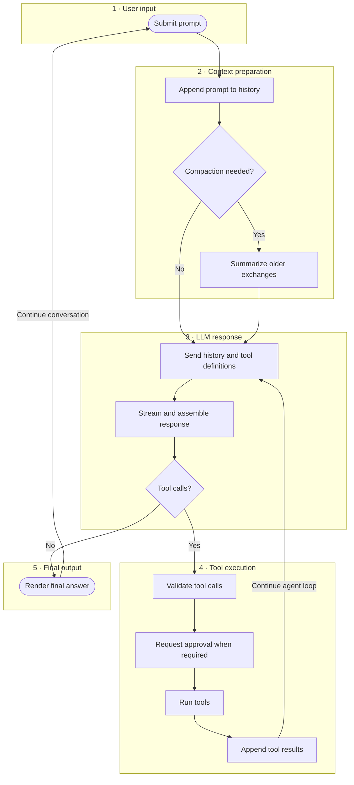

# Plain Agent

A terminal coding agent for LLM APIs compatible with OpenAI. It streams responses, keeps conversation
context, works with files, runs approved commands in an OS sandbox, and provides approved web
search and fetch tools.

## How it works



The agent sends the conversation and available tool definitions to the configured model. It
streams text into the terminal, executes requested tools, appends their results to the
conversation, and repeats until the model returns a final answer.

### Agent loop



For more detail, see
[Architecture](https://github.com/ribomo/plain-agent/blob/main/docs/architecture.md) for the
component design, request lifecycle, and trust boundaries.

## Install

Plain Agent is available on PyPI and can be installed with `pipx`:

```bash
pipx install plain-agent
```

If `pipx` is not installed, follow the [official installation guide](https://pipx.pypa.io/stable/how-to/install-pipx/).

For local development, this project uses `uv` to track the Python environment.
If `uv` is not installed, follow the [official installation guide](https://docs.astral.sh/uv/getting-started/installation/).

```bash
uv sync
```

On Linux, install Bubblewrap to enable the `run_command` tool:

```bash
# Debian / Ubuntu
sudo apt install bubblewrap

# Fedora / RHEL
sudo dnf install bubblewrap

# Arch Linux
sudo pacman -S bubblewrap
```

Plain Agent verifies that Bubblewrap is usable at startup. If it is missing or the kernel does not
permit the required user and network namespaces, command execution is disabled and the file tools
remain available. There is no unsandboxed command fallback. To keep the sandbox launcher outside
the workspace trust boundary, Plain Agent checks only `/usr/bin/bwrap` and `/bin/bwrap`; it does
not resolve Bubblewrap through `PATH`.

## Configuration

Create a local `.env` file or export environment variables in your shell. See `.env.example` for more examples.

For DeepSeek:

```bash
export DEEPSEEK_API_KEY="your-api-key"
export LLM_PROVIDER="deepseek"
export LLM_MODEL="deepseek-v4-flash"
```

For OpenAI:

```bash
export OPENAI_API_KEY="your-api-key"
export LLM_PROVIDER="openai"
export LLM_MODEL="gpt-5.4-mini"
```

You can still set `LLM_BASE_URL` when you want to override the provider default, such as pointing at a local OpenAI compatible server like Ollama.

Context compaction runs automatically when the estimated conversation history reaches 200k tokens.
Set `LLM_COMPACTION_AUTO_MAX_TOKENS` to change that threshold, or set it to `0` to disable automatic compaction.
You can also run `/compact` in the terminal to compact manually.

### Web access

The `web_search` and `web_fetch` tools use Exa and are enabled by default. Every query or URL
requires explicit approval before Plain Agent connects to `mcp.exa.ai`. Search returns links and
bounded excerpts; fetch returns bounded Markdown content for one HTTP or HTTPS URL. No Exa API key
is required.

To disable both web tools:

```bash
export PLAIN_AGENT_ENABLE_NETWORK="false"
```

This setting controls only the web tools provided with Plain Agent. The `run_command` sandbox
remains offline.

## Run

After installing with `pipx`:

```bash
plain-agent
```

For local development from a repository checkout:

```bash
uv run plain-agent
```

Enter a prompt in the terminal. Use `/compact` to summarize older conversation history, or enter
`exit` or `quit` to close the application.

## Command sandbox (Linux)

Every `run_command` request requires user approval and still runs through Bubblewrap after it is
approved. The approval prompt shows the requested mode and an unambiguous representation of the
exact argument vector using shell quoting. Backslashes and characters outside the printable range
are escaped so command arguments cannot rewrite the terminal prompt. Approval is a user decision;
Bubblewrap is the independent OS enforcement boundary.

Commands are passed as an argument array and never receive an implicit shell. For example,
`["rg", "TODO", "."]` runs directly, while shell syntax must be explicit as
`["bash", "-lc", "printf '%s\\n' *.py"]`.

Two modes are available:

- `read-only` is the default and mounts the workspace without write access.
- `workspace-write` permits persistent workspace changes, except protected paths.

Both modes have networking disabled, including host loopback. The sandbox starts with an empty
filesystem view and exposes the workspace, required system runtimes mounted as read only, a
minimal set of `/etc` files, isolated `/proc` and `/dev` filesystems, and temporary memory backed
`/tmp`, `/run`, and `HOME` directories. The environment is cleared; only a filtered `PATH`, locale,
terminal, and color settings are retained. API keys and arbitrary parent variables are not
inherited by commands.

In `workspace-write`, existing `.git` and `.venv` directories are rebound as read only. `.agents`,
`.codex`, and `.sandbox` are hidden. `.env` plus recognized private key and certificate files are
masked in both modes, as are existing pathname Unix sockets. File tools running in the Plain Agent
process continue to use their existing workspace permission checks and are not run through
Bubblewrap.

Additional toolchains can be exposed as read only with a list of absolute, existing paths separated
by the operating system path separator:

```bash
export PLAIN_AGENT_SANDBOX_ADDITIONAL_READ_ROOTS="/opt/toolchain:/home/me/.local/share/special-runtime"
```

Each extra root expands the confidentiality boundary: sandboxed commands can read everything
below it. Paths are canonicalized and deduplicated before use. Avoid exposing home directories or
credential stores.

The command sandbox is deliberately offline. Package downloads, remote Git operations, and calls
to local network services fail. Linux is the only supported command sandbox platform in this
milestone; macOS and Windows keep `run_command` disabled. Seccomp syscall filtering is planned as
the next Linux hardening step after the filesystem and network policy is stable.
