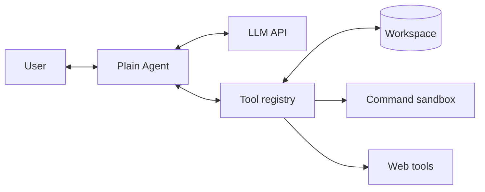
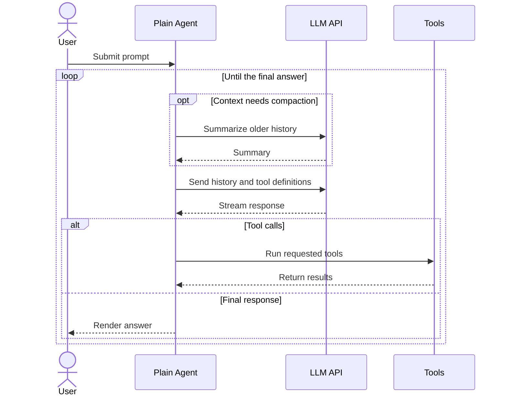
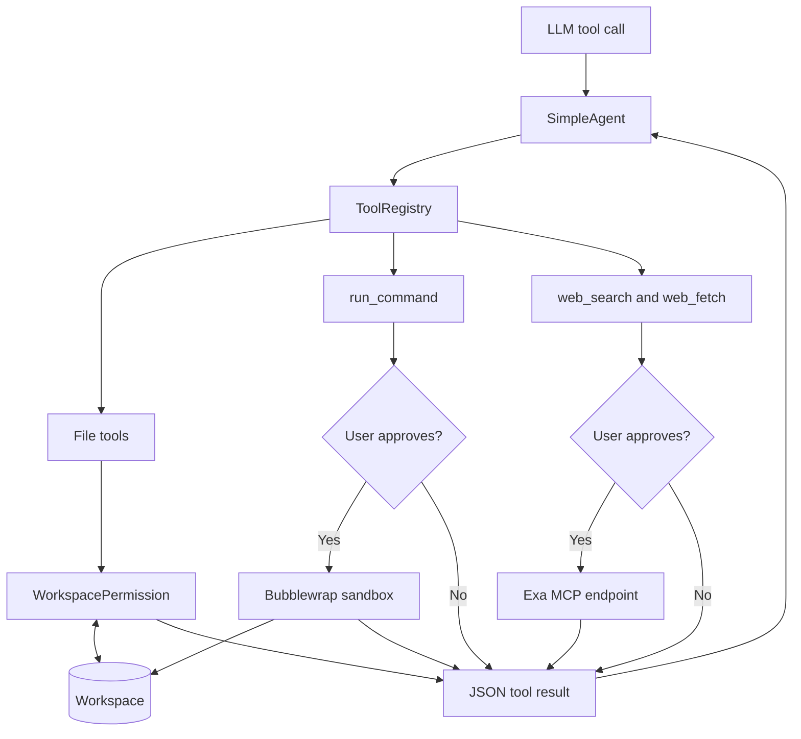
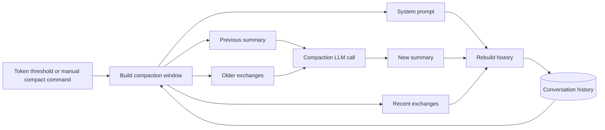
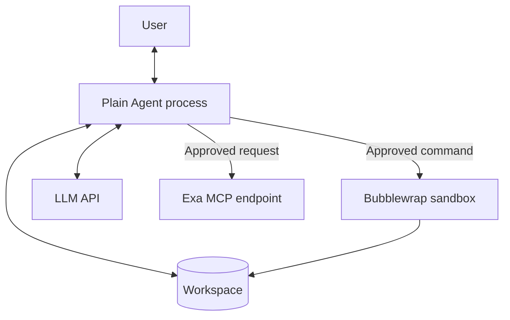
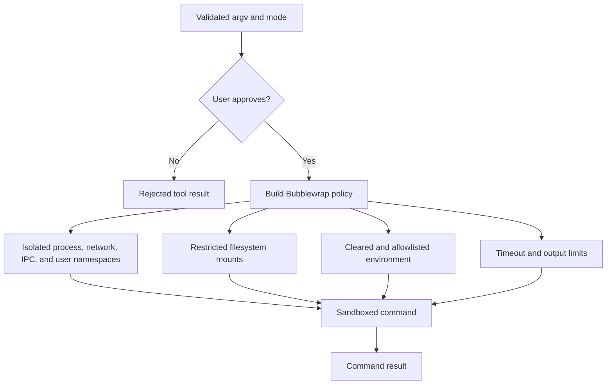

# Architecture

Plain Agent is a single-process terminal application built around a streaming Chat Completions
tool loop. The terminal UI, conversation state, tool dispatch, permissions, and provider clients
run in the main Python process. Approved commands are the exception: they execute in a separate
Bubblewrap sandbox on supported Linux systems.

## System overview

The application is assembled in `plain_agent.cli`. Configuration is loaded from environment
variables, then the CLI creates the LLM client, conversation compactor, agent, tool registry, and
terminal UI. The same LLM client serves normal responses and conversation compaction, although a
different compaction model can be configured.

## Request lifecycle

The UI runs model work on a daemon worker thread so streamed output does not block Textual's event
loop. UI updates are scheduled back onto the Textual thread.

`ChatCompletionStreamAccumulator` reconstructs assistant text and fragmented tool calls from
streaming chunks. Tool results use a JSON object with an `ok` field so the UI can distinguish
successful and failed operations. Invalid tool names and arguments are returned to the model as
tool errors rather than terminating the session.

## Components

| Component | Responsibility |
| --- | --- |
| `plain_agent.cli` | Loads `.env`, validates configuration, constructs dependencies, and starts the UI. |
| `plain_agent.ui` | Renders the transcript and status, accepts prompts, and handles approval decisions. |
| `SimpleAgent` | Owns the model/tool loop, turn limit, and conversation history. |
| `ConversationHistory` | Stores defensive copies of typed chat messages and reports serialized context size. |
| `ConversationCompactor` | Summarizes older exchanges while preserving the system prompt and recent exchanges. |
| `OpenAICompatibleClient` | Configures the OpenAI SDK for OpenAI, DeepSeek, or a custom compatible base URL. |
| `ToolRegistry` | Registers available tools, exposes model-facing schemas, and dispatches calls by name. |
| `WorkspacePermission` | Keeps file operations inside the workspace and blocks sensitive paths. |
| `PermissionController` | Routes command and web operations through a one-time user approval. |
| `CommandRuntime` | Runs an approved command through the sandbox backend with time and output limits. |
| `BubblewrapSandbox` | Constructs the Linux namespace, mount, environment, and network-isolation policy. |
| Exa clients | Send bounded search and fetch requests to the fixed Exa MCP endpoint. |

## Tool architecture

Every tool extends `BaseTool` and supplies a name, description, JSON Schema parameters, and a
`run` method. `ToolRegistry.definitions()` converts these into Chat Completions function-tool
definitions. `ToolRegistry.run()` dispatches the requested tool with the configured workspace
root.

The default registry contains:

- `list_files`, `read_file`, and `search_text` for workspace inspection.
- `write_file` and `edit_file` for workspace changes.
- `run_command` when a verified Linux Bubblewrap backend is available.
- `web_search` and `web_fetch` when network tools are enabled.

Command discovery fails closed. If Bubblewrap is missing, unsupported, or cannot enforce the
configured policy, `run_command` is not registered and the UI displays a startup warning. File
tools remain available.

## Conversation and compaction

`ConversationHistory` begins with the system prompt and groups later messages into exchanges that
start with a user message. Before each model request, the agent estimates tokens from serialized
character count. When the configured threshold is reached, the compactor:

1. Keeps the configured number of recent exchanges verbatim.
2. Sends older exchanges and any previous summary to the model.
3. Stores the new summary as assistant data, not as a system instruction.
4. Rebuilds history from the original system prompt, summary, and recent exchanges.

Manual compaction uses the same path when the user enters `/compact`.

## Trust boundaries

The current security model separates validation, user consent, and OS enforcement:

- LLM requests are core application traffic and do not prompt for per-request approval.
- Each web query or fetch requires approval before the host contacts `mcp.exa.ai`. Responses have
  byte and character limits, and fetch URLs are restricted to absolute HTTP or HTTPS URLs without
  credentials. Returned web content is external, untrusted data supplied to the model.
- File tools run in the Plain Agent process. They resolve paths against the workspace, reject path
  escapes, and block configured sensitive names and suffixes. They do not currently ask for
  per-operation approval.
- Every command requires approval and runs with `shell=False` at the host boundary. Shell behavior
  is available only when the model explicitly requests a shell executable.
- Bubblewrap commands have no network namespace access, receive a cleared and allowlisted
  environment, and see a restricted filesystem. Read-only mode is the default. Workspace-write
  mode keeps `.git` and `.venv` read-only; hides `.agents`, `.codex`, and `.sandbox`; and masks
  sensitive files and existing Unix sockets.
- Command execution is bounded by a timeout and retained-output limit. Exa calls also use timeouts
  and response-size limits.

Bubblewrap isolation currently supports Linux only. Other platforms run without `run_command`.
Seccomp syscall filtering is planned but is not part of the current sandbox policy.

### Command sandbox

## Failure behavior

- Invalid environment configuration stops startup with a validation error.
- An unavailable command sandbox disables only `run_command` and produces a warning.
- Rejected approvals become tool errors that the model can handle.
- Tool validation and runtime failures are serialized as error results.
- Model or UI worker failures end the active response and appear in the transcript without an
  unsandboxed fallback.
- The agent stops a tool loop after `max_turns` to prevent unbounded model/tool cycling.

## Extension points

- Add a tool by implementing `BaseTool` and registering it in `ToolRegistry`.
- Add an OpenAI-compatible provider through configuration defaults or `LLM_BASE_URL`.
- Add a command sandbox by implementing the `SandboxBackend` protocol, then connecting the backend
  to sandbox discovery and `ToolRegistry` assembly.
- Add a permission type by defining a request model, adding it to the `PermissionRequest` union,
  and handling its approval prompt in the UI.
